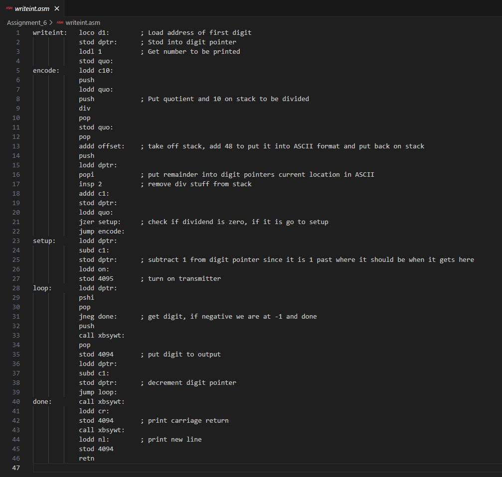
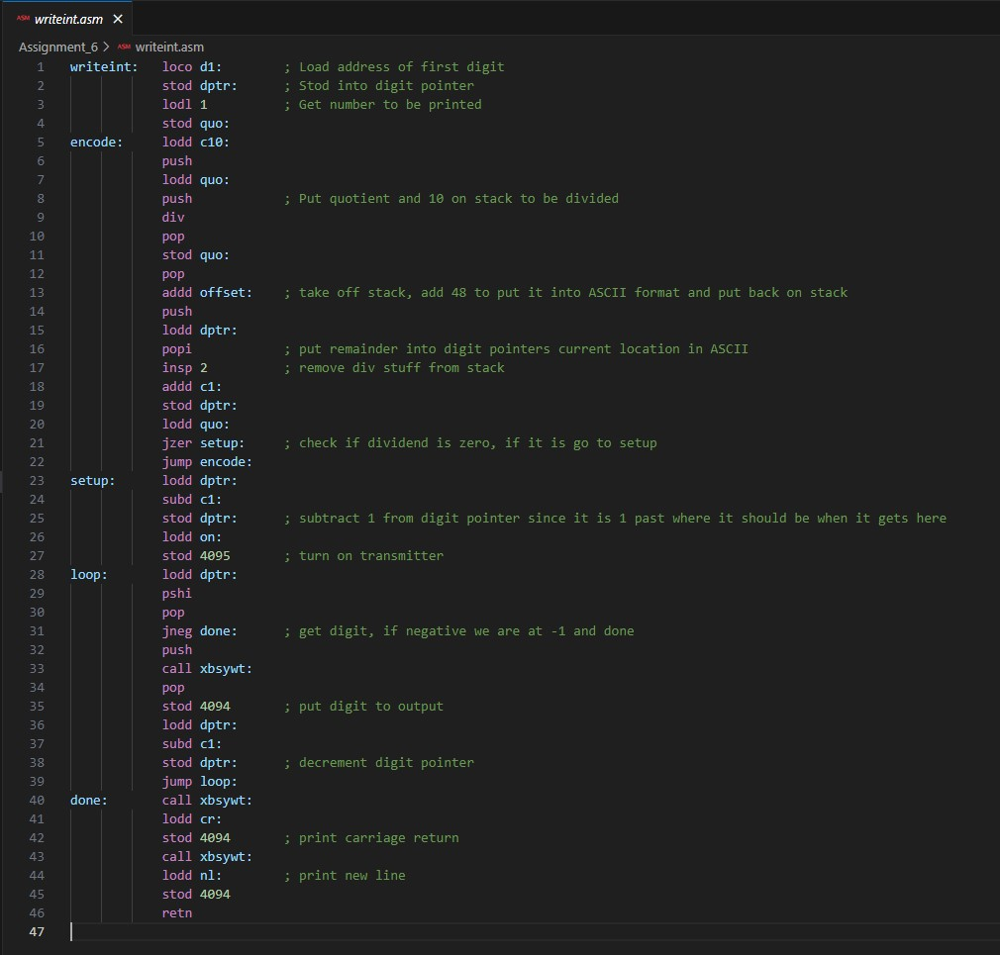
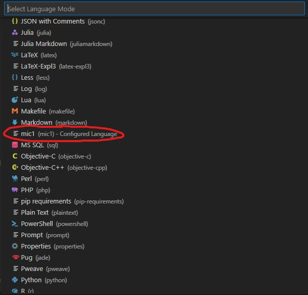

# MIC1 Syntax Highlighter

A lightweight VSCode extension that provides basic syntax highlighting for the MIC1 Assembler language.

---

## 🔍 Features

- Automatic syntax highlighting for `.asm` files
- Seamless integration with VSCode's language mode selector

---

## 📸 Before and After

### Without Extension  
See how MIC1 code appears with no highlighting:

### With Extension  
Syntax highlighting applied with the extension active:

---

## 🛠 Language Mode Integration

When the extension is installed, it automatically applies to `.asm` files. You can also manually select the language mode:

---

## ✅ Installation

You can install this extension directly from the VSCode Extensions Marketplace

---